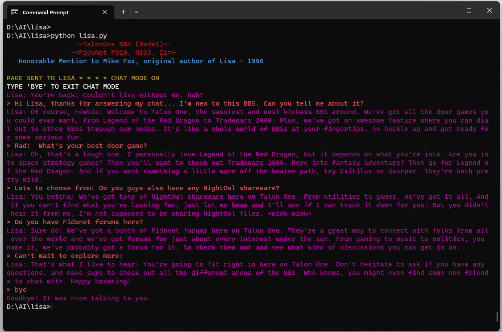

# Lisa
BBS Door 'Lisa' the chatbot

This is a reincarnation of a really slick BBS door program from 1996.  When I ran a BBS back then I always
had a lot of fun chatting with Lisa (and even more fun watching users chat with Lisa)!

Lisa has been reborn with a much upgraded brain, and has been seeded with some details of my favorite high school hang out.

It's simple to install.  All you need is Python3, and the openai library ("pip install openai").
Then just enter your OpenAI token (in lisa.py, replace "Your Token Here" with your token) and off you go!

Enjoy,
-=Talon One=-
  -=SysOp=-
